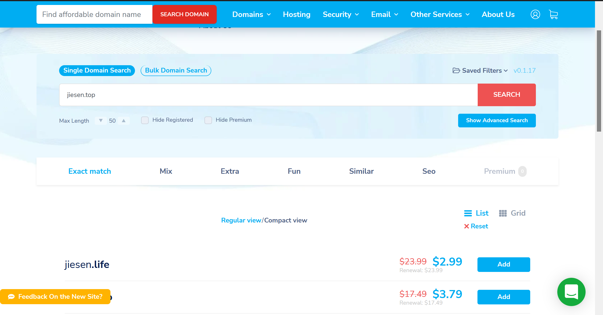
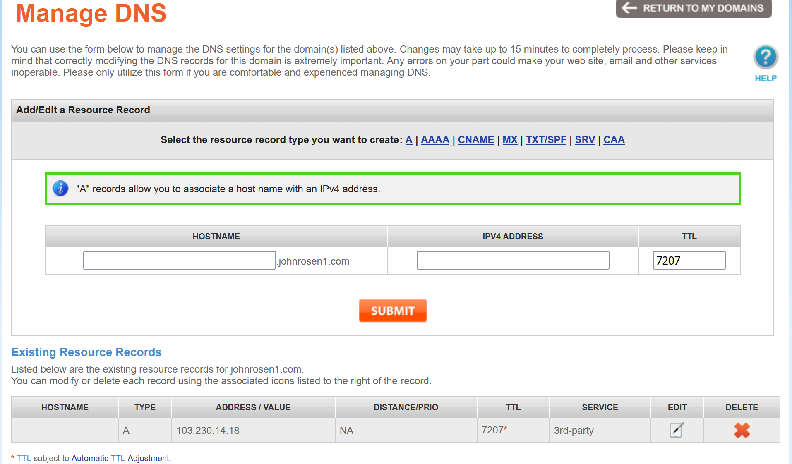
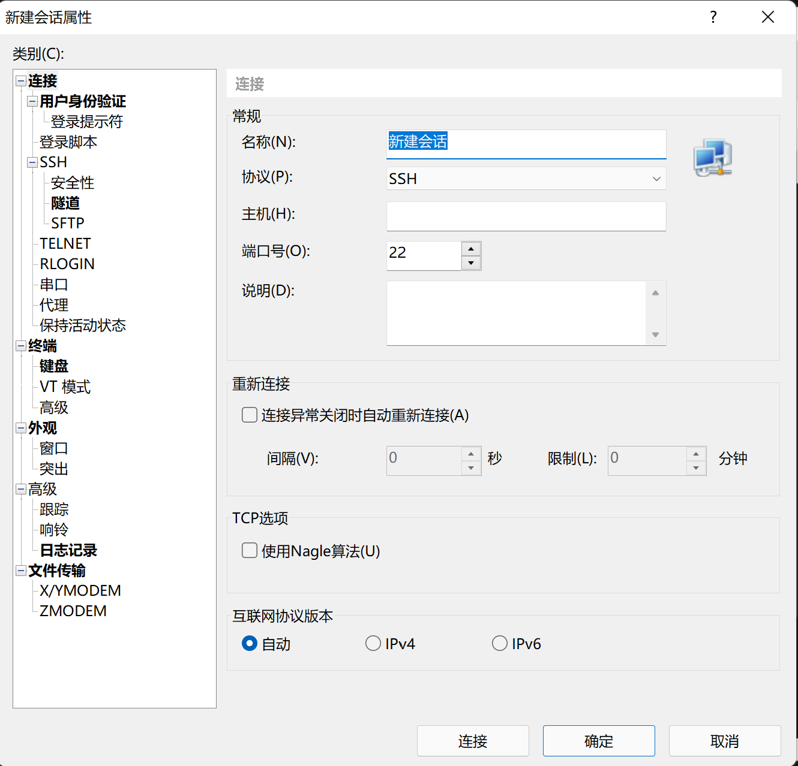
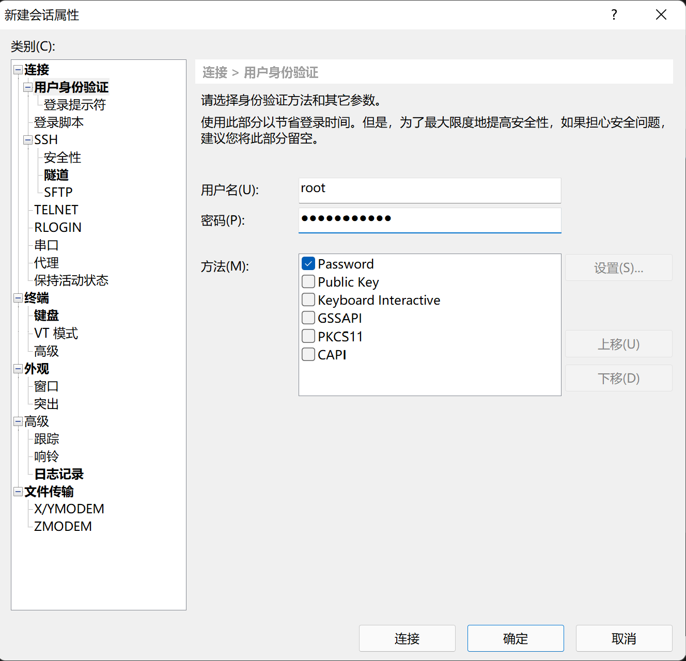
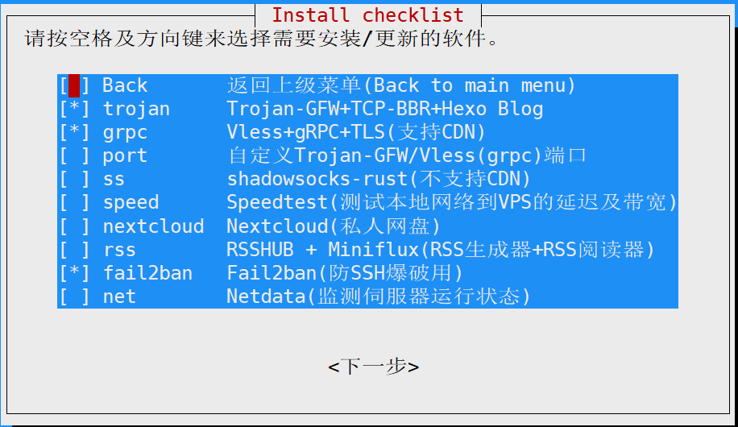
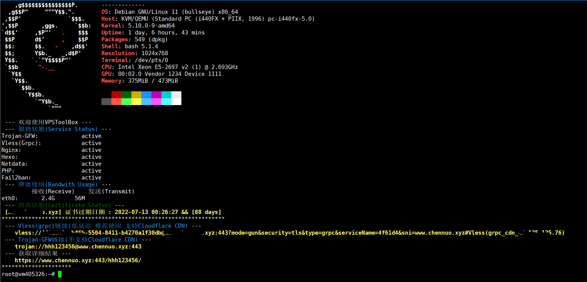
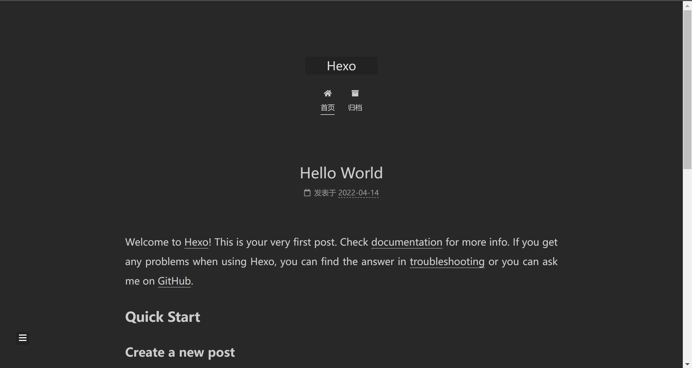
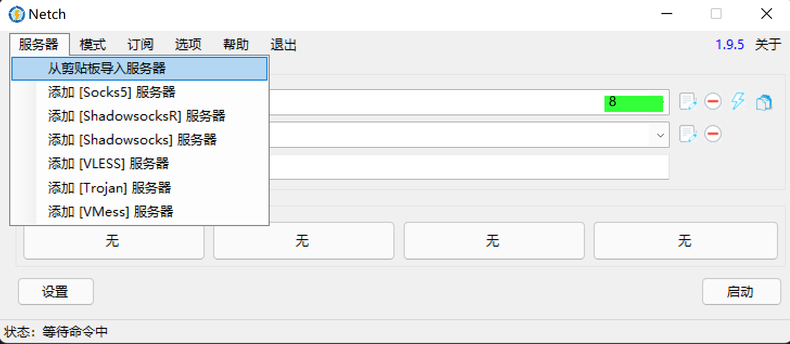
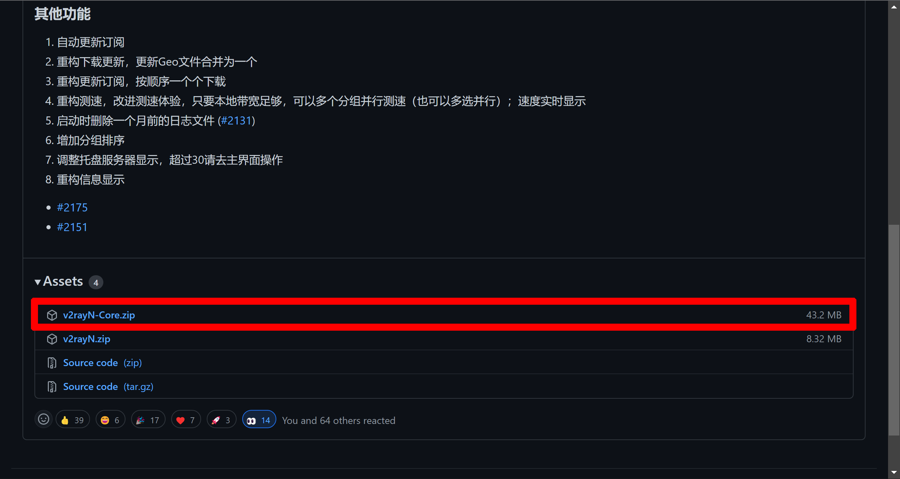

# 纯新手小白教程

虽然感觉没有什么必要，但是我还是写写好了，免得有人不会用。

> 安装中途SSH掉线的话直接重新跑一遍就行，可以覆盖安装。

> 经过一个月的测试，Vless(grpc)的使用体验结论如下：以连接数为代价降低延迟，适合并发连接数不大的使用场景，比如网页浏览，Youtube观看等，不适合拿来挂BT/爬虫等并发连接数高的使用场景，该类使用场景建议使用原版Trojan以获得更好的使用体验。

## 教程的目标

1. 学会 VPS 的购买
2. 学会 域名 的购买以及 IP 绑定
3. 学会基础 SSH 操作，能正常连接 VPS
4. 学会使用脚本搭建 博客和代理
5. 学会代理客户端的使用
6. 学会博客的使用

## VPS 购买

购买方式大同小异，这里就说基础流程。

> 这里不放具体推荐，相关内容在首页。

1. 选定需要的VPS位置，线路质量以及预期价格等基本参数（CN2 GIA和9929双程线路为高端线路）。
2. 百度或谷歌`VPS推荐`，只要你知道去哪里买就行。
3. VPS 硬件配置建议选能满足需求的最便宜的就行(1C 512M 20G SSD足矣)。

4. VPS 操作系统建议选择`Debian 11`，没有 11 选 10，没有`Debian`的话选`Ubuntu`。

## 域名的购买及 IP 绑定

1. 前往[namesilo.com](https://www.namesilo.com/?rid=685fb47qi)，注册账号，搜索你想要的域名，点击购买。

2. 打开[管理页面](https://www.namesilo.com/account_domains.php)，点击`Manage DNS for this domain`。

3. 先删掉所有不是你自己加上去的已有的解析，点击新增DNS记录，类型选择`A`，`IPv4 Address`填入 VPS 的 IP，`Hostname`可以随便填，也可以不填，TTL不用管。

4. 点击`Submit`提交修改
5. Namesilo的DNS需要15分钟生效，可以先去干其他事情。
6. 确认域名绑定已生效，前往[https://dnschecker.org/](https://dnschecker.org/)，填入域名，点击`Search`，如下方服务器列表右边为绿勾且IP地址正确则绑定成功。

## SSH 操作

1. 前往[xshell7官方免费版页面](https://www.netsarang.com/en/free-for-home-school/)，点击Both，名称随便输，邮箱填对就行。

2. 打开你的邮箱，就能拿到下载链接，下载完成后点击安装。
3. 打开 `Xshell7`，点击新增会话。

4. `主机`填入你的VPS的IP地址，端口号如果VPS提供商没有修改则默认为22。

5. 选择左边的`用户身份验证`，填入VPS的用户名和密码，若VPS提供商没有指定用户名则默认为`root`，密码一般可以在VPS控制面板或者发送给你的邮件中找到。

6. 点击下方的`连接`测试连接性，若出现 `root@xxxx:~# ` 之类字样则成功。

## 使用脚本搭建 博客和代理

1. 连接成功后，输入`apt-get update --fix-missing && apt-get install sudo curl -y && curl -Ss https://raw.githubusercontent.com/johnrosen1/vpstoolbox/master/vps.sh | sudo bash` 进行安装工作。
2. 脚本会进行初始化工作，完成后会看到以下页面。

3. 选择第一个，点击回车，会看到如下页面。

4. 因为我们只需要博客和代理，因此什么都不用改，直接继续回车，会看到以下页面。

5. 输入之前绑定了IP的域名，回车，会看到以下页面。

6. 这是系统的主密码，随便输一个就行，点击回车，等待一段时间，会看到以下页面。

7. 默认为`HTTP申请`，不用管，直接回车，安装正式开始，耐心等待即可，大概5分钟不到就能装完，装完后会有提示并出现以下界面。

8. `vless://...`以及`trojan://...`是用于将服务器导入代理客户端的链接。
9. 若`服務狀態`中所有软件皆为`active`状态，则安装成功。
10. 打开你的域名，若出现以下页面，则安装成功。

## 代理客户端的使用

1. 安卓：推荐使用[V2rayng](https://github.com/2dust/v2rayNG)，下载并安装，复制链接，点击右上角的`+`号，点击`从剪贴板导入`，选中服务器，点击右下角的`V`键，测试连接，点击最下面的`测试连接`，连接成功则有提示出现。
2. IOS：鉴于我没有IOS设备，因此只能推荐软件而不能实际测试。推荐[shadowrocket](https://apps.apple.com/us/app/shadowrocket/id932747118)
3. Windows：推荐[Netch](https://github.com/NetchX/Netch)与[V2rayN](https://github.com/2dust/v2rayN/releases/latest)，一样，点击`从剪贴板导入服务器`，模式选择`Bypass Lan and China`，点击`启动`，若连接成功则有`HTTP: xxx ms`字样出现。

V2rayN的话下载这个文件

4. Linux：推荐使用[v2rayA](https://github.com/v2rayA/v2rayA)，更多的请看官方文档。

## 博客的使用

Hexo没有图形化界面，需要SSH操作，这里仅介绍基本流程，主题以及更多内容请看[官方文档](https://hexo.io/zh-cn/)。

1. 写好一份`xxx.md`文件
2. 进入博客路径，`cd /usr/share/nginx/hexo`
3. 新增一篇文章，`hexo new xxx`
4. 使用`Xftp 7`将`xxx.md`覆盖上传至`/usr/share/nginx/hexo/source/_posts`，图片等请放在同目录与.md文件同名的文件夹下，调用直接写`[xxx](xxx.png)`即可。
5. 发布新文章`cd /usr/share/nginx/hexo && hexo g`。
6. 访问域名确认新文章成功上传。

## 总结

说实话，脚本完成了大部分的工作，如果不是有脚本，搭建这样一套简单的系统也可以花费一天的时间，而现在只需要5分钟就能完成了，果然懒惰才是第一生产力，2333。